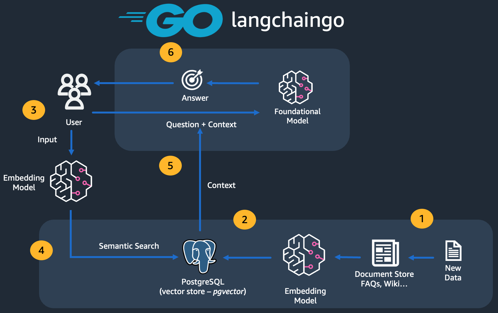

# How to use Retrieval Augmented Generation (RAG) for Go applications

> Implement RAG (using LangChain and PostgreSQL) to improve the accuracy and relevance of LLM outputs

This repository contains source code corresponding to the blog post [How to use Retrieval Augmented Generation (RAG) for Go applications](https://community.aws/content/2f1mRXuakNO22izRKDVNRazzxhb) which covers how to leverage the [Go programming language](https://go.dev/) to use Vector Databases and techniques such as Retrieval Augmented Generation (RAG) with [langchaingo](https://github.com/tmc/langchaingo). 

Large Language Models (LLMs) and other foundation models have been trained on a large corpus of data enabling them to perform well at many natural language processing (NLP) tasks. But one of the most important limitations is that most foundation models and LLMs use a static dataset which often has a specific knowledge cut-off (say, January 2023). 

RAG (Retrieval Augmented Generation) enhances LLMs by dynamically retrieving external information during the response generation process, thereby expanding the model's knowledge base beyond its original training data. RAG-based solutions incorporate a vector store which can be indexed and queried to retrieve the most recent and relevant information, thereby extending the LLM's knowledge beyond its training cut-off. When an LLM equipped with RAG needs to generate a response, it first queries a vector store to find relevant, up-to-date information related to the query. This process ensures that the model's outputs are not just based on its pre-existing knowledge but are augmented with the latest information, thereby improving the accuracy and relevance of its responses.

## Security

See [CONTRIBUTING](CONTRIBUTING.md#security-issue-notifications) for more information.

## License

This library is licensed under the MIT-0 License. See the LICENSE file.

